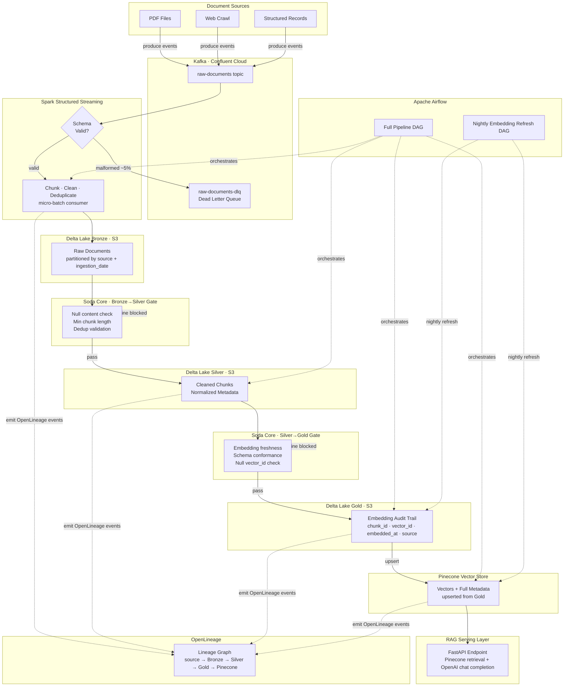

# RAG Data Pipeline

**A production-grade, lakehouse-native ingestion and retrieval-augmented generation (RAG) system built for scale, correctness, and full observability.**

This pipeline ingests documents from heterogeneous sources, processes them through a medallion lakehouse architecture (Bronze → Silver → Gold) enforced by data quality contracts, generates embeddings in parallel via the OpenAI API, and serves semantic search through a FastAPI RAG endpoint. Every design decision — from idempotent chunk IDs to contract-gated layer transitions — prioritizes operational correctness over convenience.

---

## Table of Contents

1. [Architecture](#architecture)
2. [Stack](#stack)
3. [System Design & Technology Rationale](#system-design--technology-rationale)
4. [Design Principles](#design-principles)
5. [Data Flow](#data-flow)
6. [Pipeline Stages](#pipeline-stages)
7. [Data Quality Contracts](#data-quality-contracts)
8. [Orchestration](#orchestration)
9. [Lineage & Observability](#lineage--observability)
10. [Project Structure](#project-structure)
11. [Environment Variables](#environment-variables)
12. [Getting Started](#getting-started)
13. [Build Plan](#build-plan)
14. [License](#license)

---

## Architecture



---

## Stack

| Layer | Technology | Role |
|---|---|---|
| **Message Bus** | Kafka (Confluent Cloud) | Durable, ordered event delivery from all document sources |
| **Stream Processing** | Spark Structured Streaming | Micro-batch ingestion, chunking, cleaning, deduplication |
| **Batch Processing** | PySpark | Metadata normalization (Bronze→Silver), parallel embedding calls (Silver→Gold) |
| **Lakehouse Storage** | Delta Lake on AWS S3 | ACID transactions, time travel, schema enforcement across all medallion layers |
| **Embedding Model** | OpenAI `text-embedding-3-small` | 1536-dimension dense vectors for semantic search |
| **Vector Store** | Pinecone | Approximate nearest-neighbor search at production scale |
| **Data Quality** | Soda Core | Contract-driven layer transitions; freshness, null, and dedup checks |
| **Orchestration** | Apache Airflow | DAG-based pipeline scheduling and dependency management |
| **Lineage** | OpenLineage | End-to-end lineage graph from source document to Pinecone vector |
| **Serving** | FastAPI | Low-latency RAG endpoint combining Pinecone retrieval with OpenAI chat completion |
| **Language** | Python 3.11+ | Consistent runtime across streaming, batch, serving, and quality layers |

---

## System Design & Technology Rationale

### Why Kafka?

Confluent Cloud Kafka decouples document producers from all downstream consumers. Producers (PDF parsers, web crawlers, database change events) publish to `raw-documents` without any knowledge of what consumes them. This enables independent scaling of ingestion and processing, guaranteed message ordering within a partition, and replay capability for reprocessing historical data. The Dead Letter Queue (`raw-documents-dlq`) is a separate Kafka topic, preserving the malformed payload and failure reason without contaminating the main stream.

### Why Spark Structured Streaming?

Spark Structured Streaming gives exactly-once semantics with checkpointing, native Delta Lake integration, and the ability to express streaming logic as a SQL-style query on an unbounded DataFrame. Micro-batch mode (rather than continuous processing) keeps latency acceptable for a document pipeline (seconds to minutes) while dramatically simplifying failure recovery — each checkpoint marks processed offsets, so a restart resumes cleanly without duplicate writes.

### Why Delta Lake?

Delta Lake is the backbone of this architecture. ACID transactions mean Bronze writes are atomic; a partial Spark job cannot leave a corrupt Bronze table. Schema enforcement catches upstream data model changes before they silently corrupt downstream layers. Time travel means any version of Bronze, Silver, or Gold is queryable for debugging or reprocessing — Pinecone can always be rebuilt by replaying Gold. Change Data Feed (CDF) enables incremental Silver→Gold processing without full-table scans.

### Why the Medallion Architecture?

Each layer has a defined contract and a single responsibility:

- **Bronze** — raw fidelity. Preserves the original event exactly as received from Kafka, including malformed fields. No transformations. Partitioned by `source` and `ingestion_date` for efficient downstream reads.
- **Silver** — clean and normalized. Metadata is standardized, duplicates removed, chunk lengths validated. This is the canonical analytical dataset.
- **Gold** — embedding audit trail. Records that a specific chunk was embedded at a specific time, producing a specific vector ID. Gold is the source of truth for Pinecone's state.

Separating concerns this way means a bug in the embedding step cannot corrupt the cleaned Silver chunks, and a schema change in Silver can be applied independently of re-embedding.

### Why Pinecone?

Pinecone is a managed vector database purpose-built for approximate nearest-neighbor (ANN) search. It handles index sharding, replication, and horizontal scaling transparently. Critically, Pinecone accepts a `vector_id` on upsert, which this pipeline sets to `chunk_id` — making upserts idempotent. Every Pinecone vector carries the full metadata set (`source`, `chunk_id`, `document_id`, `ingested_at`, `embedded_at`), enabling filtering and attribution in the RAG response.

### Why Soda Core for Data Quality?

Soda Core defines quality checks as code (YAML contracts) that run as pipeline gates. Unlike ad-hoc `assert` statements, Soda checks are versioned, auditable, and produce structured scan results that integrate with alerting. Checks at the Bronze→Silver transition prevent dirty data from entering the normalized layer. Checks at the Silver→Gold transition enforce the 24-hour freshness SLA. A Soda failure raises an exception in Airflow, blocking downstream tasks until the issue is resolved — no silent data quality degradation.

### Why OpenLineage?

OpenLineage captures dataset-level lineage across every stage: which input datasets a job read, which output datasets it wrote, and when. This produces a directed acyclic lineage graph from source document through Bronze, Silver, Gold, and into Pinecone. When a RAG response is wrong, lineage lets you trace the exact source chunk, its ingestion event, and when it was embedded — reducing mean time to root cause from hours to minutes.

---

## Design Principles

### 1. Idempotent Embedding Pipeline

Every chunk is assigned a `chunk_id` computed as:

```python
import hashlib

def make_chunk_id(document_id: str, chunk_index: int, content: str) -> str:
    payload = f"{document_id}:{chunk_index}:{content}"
    return hashlib.sha256(payload.encode()).hexdigest()
```

This `chunk_id` is used directly as the Pinecone `vector_id`. Because Pinecone upsert is idempotent on `vector_id`, re-running any part of the pipeline — whether due to a bug fix, reprocessing, or infrastructure failure — produces exactly the same state. There is no risk of duplicate vectors accumulating in the index.

### 2. Delta Lake as Source of Truth

Pinecone is a **derived projection** of the Gold Delta table. It can be dropped and rebuilt at any time by replaying the Gold table through the embedding job. Gold is the authoritative record of what was embedded and when. This means:

- Pinecone index corruption → rebuild from Gold.
- Schema change in embedding model → re-embed from Silver, overwrite Gold, re-upsert Pinecone.
- Audit query ("what was embedded on 2026-01-15?") → query Gold with `WHERE DATE(embedded_at) = '2026-01-15'`.

Pinecone is never the system of record.

### 3. Full Metadata on Every Pinecone Vector

Every vector upserted to Pinecone carries:

```json
{
  "id": "a3f9b2c1...",
  "values": [0.012, -0.034, ...],
  "metadata": {
    "source": "s3://docs/acme-whitepaper.pdf",
    "document_id": "doc-8821",
    "chunk_id": "a3f9b2c1...",
    "chunk_index": 4,
    "ingested_at": "2026-01-15T08:32:11Z",
    "embedded_at": "2026-01-15T09:01:44Z",
    "content_preview": "The architecture relies on..."
  }
}
```

This enables filtered retrieval (e.g., only chunks from a specific source), attribution in RAG responses, and freshness debugging without querying Delta Lake for every request.

### 4. Contract-Driven Layer Transitions

Layer transitions are gated by Soda Core scan results. In Airflow:

```
bronze_write >> run_soda_bronze_checks >> silver_transform
silver_write >> run_soda_silver_checks >> gold_embed
```

If `run_soda_bronze_checks` raises a `SodaScanError`, Airflow marks that task as failed and blocks `silver_transform`. The pipeline does not proceed with dirty data. Soda scan results are written to a persistent scan store for audit.

### 5. 24-Hour Freshness Contracts

A Silver chunk that has no corresponding Gold record within 24 hours of its `ingested_at` timestamp is a Soda Core violation:

```yaml
# soda/checks/silver_freshness.yml
checks for silver_chunks:
  - freshness(ingested_at) < 24h:
      name: All Silver chunks embedded within 24 hours
      filter: gold_embedding_id IS NULL
```

This check runs as part of the nightly Airflow DAG. Violation triggers an alert and blocks the next pipeline run, forcing resolution before new embeddings proceed.

### 6. Dead Letter Queue

Kafka consumers validate each event against a strict Avro/JSON schema before routing it to processing. Events failing validation (~5% in practice, typically malformed PDFs or encoding errors) are routed to `raw-documents-dlq` with the original payload and a structured failure reason:

```json
{
  "original_payload": "...",
  "failure_reason": "MISSING_FIELD: document_id",
  "failed_at": "2026-01-15T08:31:05Z",
  "consumer_group": "spark-ingestion"
}
```

The DLQ is monitored separately. Operators can inspect, fix, and re-publish events to `raw-documents` without impacting the running pipeline. The main topic is never blocked by malformed events.

### 7. OpenLineage Observability

OpenLineage events are emitted at each job boundary using the Python client:

```python
from openlineage.client import OpenLineageClient
from openlineage.client.run import RunEvent, RunState, Job, Run, Dataset

client = OpenLineageClient.from_environment()

# On Bronze write:
client.emit(RunEvent(
    eventType=RunState.COMPLETE,
    job=Job(namespace="rag-pipeline", name="spark.bronze_write"),
    inputs=[Dataset(namespace="kafka", name="raw-documents")],
    outputs=[Dataset(namespace="s3", name="delta.bronze.documents")],
    ...
))
```

This builds a lineage graph queryable in Marquez or any OpenLineage-compatible backend: `source_event → bronze_chunk → silver_chunk → gold_embedding → pinecone_vector`. When debugging a retrieval quality issue, the full provenance of any vector is one lineage query away.

### 8. PySpark mapPartitions for Embeddings

Embedding generation uses `mapPartitions` to batch all chunks in a Spark partition into a single OpenAI API call rather than one call per row:

```python
def embed_partition(rows):
    texts = [row["content"] for row in rows]
    if not texts:
        return
    response = openai_client.embeddings.create(
        input=texts,
        model="text-embedding-3-small"
    )
    for row, embedding_obj in zip(rows, response.data):
        yield {**row, "embedding": embedding_obj.embedding, "embedded_at": datetime.utcnow()}

silver_df.rdd.mapPartitions(embed_partition).toDF(gold_schema)
```

This reduces API round-trips by ~100x compared to row-by-row UDFs, stays within OpenAI's batch size limits, and keeps Spark executor utilization high during the I/O wait. Partition size is tuned to match the OpenAI embedding API's maximum input count (2048 items per request).

---

## Data Flow

```
┌─────────────────────────────────────────────────────────────────────────┐
│  Document Sources                                                        │
│  PDFs · Web Crawl · Structured Records                                   │
└───────────────────────────┬─────────────────────────────────────────────┘
                            │ Kafka produce
                            ▼
┌─────────────────────────────────────────────────────────────────────────┐
│  Kafka · raw-documents topic (Confluent Cloud)                           │
│  ├── valid events   ──────────────────────────────────────► Spark       │
│  └── invalid events (~5%) ──────────────────────────────► DLQ topic     │
└─────────────────────────────────────────────────────────────────────────┘
                            │ Spark Structured Streaming
                            │ chunk · clean · deduplicate
                            ▼
┌─────────────────────────────────────────────────────────────────────────┐
│  BRONZE · Delta Lake on S3                                               │
│  s3://bucket/delta/bronze/documents/                                     │
│  Partition: source= / ingestion_date=                                    │
│  Schema: document_id, source, raw_content, metadata, ingested_at         │
└───────────────────────────┬─────────────────────────────────────────────┘
                            │ Soda Core gate (null · length · dedup)
                            │ PySpark batch normalize + enrich
                            ▼
┌─────────────────────────────────────────────────────────────────────────┐
│  SILVER · Delta Lake on S3                                               │
│  s3://bucket/delta/silver/chunks/                                        │
│  Schema: chunk_id, document_id, source, content, chunk_index,            │
│          char_count, ingested_at, normalized_at                          │
└───────────────────────────┬─────────────────────────────────────────────┘
                            │ Soda Core gate (freshness · schema · nulls)
                            │ PySpark mapPartitions → OpenAI Embeddings API
                            ▼
┌─────────────────────────────────────────────────────────────────────────┐
│  GOLD · Delta Lake on S3                                                 │
│  s3://bucket/delta/gold/embeddings/                                      │
│  Schema: chunk_id, vector_id, document_id, source,                       │
│          embedded_at, model_version, embedding_dim                       │
└───────────────────────────┬─────────────────────────────────────────────┘
                            │ Pinecone upsert (vector_id = chunk_id)
                            ▼
┌─────────────────────────────────────────────────────────────────────────┐
│  Pinecone Vector Store                                                   │
│  Index: rag-documents · Dimension: 1536 · Metric: cosine                 │
│  Metadata: source, chunk_id, document_id, ingested_at, embedded_at       │
└───────────────────────────┬─────────────────────────────────────────────┘
                            │ similarity search (top-k)
                            ▼
┌─────────────────────────────────────────────────────────────────────────┐
│  FastAPI RAG Endpoint                                                    │
│  POST /query → Pinecone retrieval → OpenAI chat completion → response    │
└─────────────────────────────────────────────────────────────────────────┘
```

---

## Pipeline Stages

| Stage | Technology | Input | Output | Key Operations |
|---|---|---|---|---|
| **Ingestion** | Kafka Producer | Source documents | `raw-documents` topic | Schema validation, DLQ routing |
| **Stream Processing** | Spark Structured Streaming | `raw-documents` | Bronze Delta table | Chunking, cleaning, deduplication, micro-batch checkpointing |
| **Bronze Quality Gate** | Soda Core | Bronze table | Pass/fail | Null content, minimum chunk length, duplicate chunk_id |
| **Silver Transform** | PySpark batch | Bronze Delta | Silver Delta | Metadata normalization, field enrichment, filter malformed |
| **Silver Quality Gate** | Soda Core | Silver table | Pass/fail | Embedding freshness (24h), schema conformance, null content |
| **Embedding** | PySpark + OpenAI API | Silver Delta | Gold Delta | `mapPartitions` batch embedding, SHA-256 chunk_id generation |
| **Vector Upsert** | PySpark + Pinecone SDK | Gold Delta | Pinecone index | Idempotent upsert, full metadata attachment |
| **Freshness Check** | Soda Core | Silver + Gold | Pass/fail | Flag Silver chunks with no Gold record within 24 hours |
| **RAG Serving** | FastAPI + Pinecone + OpenAI | User query | LLM response | Embedding query, top-k retrieval, context assembly, completion |

---

## Data Quality Contracts

Soda Core checks are defined as YAML contracts and run as Airflow tasks. A failed scan raises a `SodaScanError` that blocks the downstream task. Scan results are persisted to a Soda Cloud workspace for historical audit.

### Bronze → Silver Gate (`soda/checks/bronze.yml`)

```yaml
checks for bronze_documents:
  - missing_count(content) = 0:
      name: No null content in Bronze
  - min(char_count) >= 50:
      name: Minimum chunk length 50 characters
  - duplicate_count(chunk_id) = 0:
      name: No duplicate chunk IDs in Bronze
  - schema:
      name: Bronze schema conformance
      fail:
        when required column missing: [document_id, source, content, ingested_at]
```

### Silver → Gold Gate (`soda/checks/silver.yml`)

```yaml
checks for silver_chunks:
  - missing_count(content) = 0:
      name: No null content in Silver
  - missing_count(chunk_id) = 0:
      name: No null chunk IDs
  - min(char_count) >= 50:
      name: Minimum normalized chunk length
  - schema:
      name: Silver schema conformance
      fail:
        when required column missing:
          [chunk_id, document_id, source, content, chunk_index, ingested_at]
```

### Nightly Freshness Contract (`soda/checks/freshness.yml`)

```yaml
checks for silver_chunks:
  - freshness(ingested_at) < 24h:
      name: All Silver chunks embedded within SLA
      filter: >
        chunk_id NOT IN (SELECT chunk_id FROM gold_embeddings)
      fail:
        when not between: [0%, 0%]
```

A non-zero count of Silver chunks without Gold records beyond the 24-hour window triggers a pipeline alert and blocks the next scheduled run.

---

## Orchestration

Two Airflow DAGs manage the pipeline lifecycle.

### DAG 1 — Full Pipeline (`dags/pipeline_dag.py`)

Runs on a configurable schedule (default: every 30 minutes for streaming trigger + batch).

```
kafka_health_check
    └── spark_streaming_trigger        # start/confirm streaming job
            └── bronze_soda_gate       # Soda Core Bronze checks
                    └── silver_transform_job
                            └── silver_soda_gate   # Soda Core Silver checks
                                    └── gold_embed_job
                                            └── pinecone_upsert_job
```

Each task uses a dedicated Airflow operator:
- **`SparkSubmitOperator`** — submits PySpark jobs to the Spark cluster
- **`SodaScanOperator`** (custom) — runs Soda Core scans and raises on failure
- **`PineconeUpsertOperator`** (custom) — reads Gold incremental CDF and upserts to Pinecone

### DAG 2 — Nightly Embedding Refresh (`dags/refresh_dag.py`)

Runs at 02:00 UTC daily. Identifies Silver chunks not present in Gold within the freshness window, re-embeds, and upserts.

```
identify_stale_chunks
    └── silver_freshness_soda_gate
            └── re_embed_stale_chunks
                    └── pinecone_upsert_stale
                            └── post_refresh_soda_gate
```

Both DAGs write task metadata and scan results to an Airflow XCom store for downstream alerting.

---

## Lineage & Observability

OpenLineage events are emitted at each job boundary using the Python OpenLineage client. The lineage graph covers:

```
kafka://raw-documents
    → spark://bronze_write          → s3://delta/bronze/documents
    → spark://silver_transform      → s3://delta/silver/chunks
    → spark://gold_embed            → s3://delta/gold/embeddings
    → spark://pinecone_upsert       → pinecone://rag-documents
```

Each event carries:
- **Job name and namespace** — uniquely identifies the processing step
- **Run ID** — correlated with the Airflow DAG run ID for cross-system tracing
- **Input/output datasets** — with schema snapshots at time of run
- **Custom facets** — embedding model version, Soda scan result reference, chunk count

The lineage backend (Marquez or any OpenLineage-compatible server) provides a queryable API:

```bash
# Trace the lineage of a specific chunk
curl "http://lineage-api/api/v1/lineage?nodeId=dataset:s3/delta/silver/chunks"
```

---

## Project Structure

```
rag-data-pipeline/
├── dags/
│   ├── pipeline_dag.py              # Full pipeline Airflow DAG
│   └── refresh_dag.py               # Nightly embedding refresh DAG
├── spark/
│   ├── streaming/
│   │   └── bronze_ingest.py         # Spark Structured Streaming job
│   └── batch/
│       ├── silver_transform.py      # Bronze → Silver PySpark batch job
│       └── gold_embed.py            # Silver → Gold embedding job (mapPartitions)
├── pinecone/
│   └── upsert.py                    # Gold → Pinecone upsert job
├── soda/
│   └── checks/
│       ├── bronze.yml               # Bronze quality contracts
│       ├── silver.yml               # Silver quality contracts
│       └── freshness.yml            # 24-hour freshness contract
├── api/
│   ├── main.py                      # FastAPI application
│   ├── retrieval.py                 # Pinecone query + context assembly
│   └── completion.py                # OpenAI chat completion wrapper
├── lineage/
│   └── emitter.py                   # OpenLineage event emission helpers
├── producers/
│   ├── pdf_producer.py              # PDF → Kafka producer
│   ├── web_producer.py              # Web crawl → Kafka producer
│   └── dlq_monitor.py               # DLQ inspection and re-publish utility
├── schemas/
│   ├── raw_document.avsc            # Avro schema for raw-documents topic
│   └── dlq_event.avsc               # Avro schema for DLQ events
├── config/
│   └── settings.py                  # Centralized config with Pydantic Settings
├── tests/
│   ├── unit/
│   │   ├── test_chunking.py
│   │   ├── test_chunk_id.py
│   │   └── test_embedding_batch.py
│   └── integration/
│       ├── test_bronze_write.py
│       ├── test_soda_gates.py
│       └── test_pinecone_upsert.py
├── docker/
│   ├── docker-compose.yml           # Local dev: Kafka, Spark, Airflow, Marquez
│   └── airflow/
│       └── Dockerfile
├── .env.example                     # Environment variable template
├── requirements.txt
├── pyproject.toml
└── README.md
```

---

## Environment Variables

| Variable | Description | Example |
|---|---|---|
| `KAFKA_BOOTSTRAP_SERVERS` | Confluent Cloud bootstrap URL | `pkc-xxxx.us-east-1.aws.confluent.cloud:9092` |
| `KAFKA_API_KEY` | Confluent Cloud API key | `ABC123...` |
| `KAFKA_API_SECRET` | Confluent Cloud API secret | `xyz...` |
| `KAFKA_RAW_TOPIC` | Main Kafka topic name | `raw-documents` |
| `KAFKA_DLQ_TOPIC` | Dead letter queue topic name | `raw-documents-dlq` |
| `AWS_ACCESS_KEY_ID` | AWS credentials for S3 | `AKIA...` |
| `AWS_SECRET_ACCESS_KEY` | AWS secret key | `...` |
| `AWS_REGION` | AWS region | `us-east-1` |
| `DELTA_BRONZE_PATH` | S3 path for Bronze Delta table | `s3://my-bucket/delta/bronze/documents` |
| `DELTA_SILVER_PATH` | S3 path for Silver Delta table | `s3://my-bucket/delta/silver/chunks` |
| `DELTA_GOLD_PATH` | S3 path for Gold Delta table | `s3://my-bucket/delta/gold/embeddings` |
| `OPENAI_API_KEY` | OpenAI API key | `sk-...` |
| `OPENAI_EMBEDDING_MODEL` | Embedding model ID | `text-embedding-3-small` |
| `OPENAI_CHAT_MODEL` | Chat completion model ID | `gpt-4o` |
| `PINECONE_API_KEY` | Pinecone API key | `...` |
| `PINECONE_ENVIRONMENT` | Pinecone environment | `us-east-1-aws` |
| `PINECONE_INDEX_NAME` | Pinecone index name | `rag-documents` |
| `SODA_CLOUD_API_KEY` | Soda Cloud API key (optional) | `...` |
| `OPENLINEAGE_URL` | OpenLineage backend URL | `http://localhost:5000` |
| `AIRFLOW__CORE__FERNET_KEY` | Airflow encryption key | `...` |

---

## Getting Started

### Prerequisites

- Docker and Docker Compose
- Python 3.11+
- A Confluent Cloud account (or local Kafka via Docker)
- AWS credentials with S3 read/write access
- OpenAI API key
- Pinecone account

### 1. Clone the Repository

```bash
git clone https://github.com/arcofiero/rag-data-pipeline.git
cd rag-data-pipeline
```

### 2. Configure Environment

```bash
cp .env.example .env
# Edit .env with your credentials — see Environment Variables table above
```

### 3. Install Python Dependencies

```bash
python -m venv .venv
source .venv/bin/activate
pip install -r requirements.txt
```

### 4. Start Local Infrastructure

```bash
docker compose -f docker/docker-compose.yml up -d
# Starts: Kafka (local), Spark, Airflow, Marquez (OpenLineage backend)
```

### 5. Initialize Delta Tables

```bash
python -m spark.batch.init_tables
```

### 6. Run the Streaming Job

```bash
spark-submit spark/streaming/bronze_ingest.py
```

### 7. Trigger a Pipeline Run

```bash
# Via Airflow UI at http://localhost:8080
# Or via CLI:
airflow dags trigger pipeline_dag
```

### 8. Start the FastAPI Serving Layer

```bash
uvicorn api.main:app --host 0.0.0.0 --port 8000 --reload
# POST http://localhost:8000/query  {"query": "What is the architecture?"}
```

---

## Build Plan

| Day | Milestone | Deliverables |
|---|---|---|
| **0** | Repo scaffold & infrastructure | Project structure, Docker Compose (Kafka, Spark, Airflow, Marquez), `.env.example`, Avro schemas |
| **1** | Kafka producers & DLQ | PDF producer, web crawl producer, schema validation, DLQ routing with failure reason |
| **2** | Spark Structured Streaming → Bronze | Bronze ingest job, Kafka consumer, chunking logic, SHA-256 chunk_id, Delta write with partitioning |
| **3** | Soda Core Bronze gate | Bronze quality checks (null, length, dedup), Soda scan integration, Airflow gate task |
| **4** | PySpark Silver transform | Bronze→Silver batch job, metadata normalization, filter malformed chunks, Delta merge |
| **5** | Soda Core Silver gate + freshness | Silver quality checks, 24-hour freshness contract, nightly DAG skeleton |
| **6** | OpenAI embedding + Gold | `mapPartitions` embedding job, Gold Delta write, idempotent upsert logic |
| **7** | Pinecone upsert + metadata | Gold→Pinecone upsert with full metadata, idempotency verification, index initialization |
| **8** | Airflow DAGs | Full pipeline DAG, nightly refresh DAG, XCom metadata, alerting hooks |
| **9** | OpenLineage integration | Emitter helpers at each job boundary, Marquez lineage graph validation |
| **10** | FastAPI RAG endpoint + tests | `/query` endpoint, retrieval + completion, unit and integration test suite, load test |

---

## License

MIT License. See [LICENSE](LICENSE) for details.
